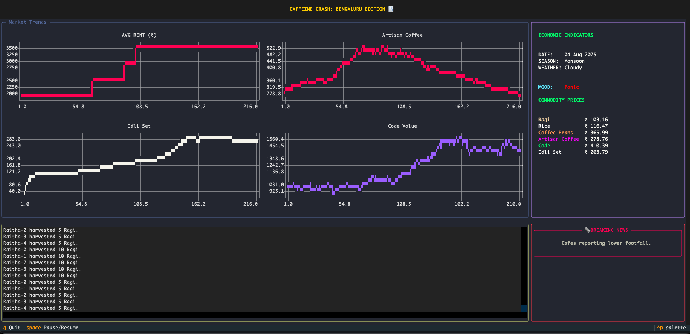

# Caffeine Crash: tech Edition

**"High Rent. Expensive Coffee. Zero Savings."**



An interactive TUI simulation of the (hypothetical) **Stagflation** trap in the tech ecosystem.

## What is Stagflation?

Stagflation is an economic condition characterized by the simultaneous occurrence of stagnant economic growth, high unemployment, and high inflation. This phenomenon challenges traditional economic theory, which suggests that inflation and unemployment have an inverse relationship (Phillips Curve). The term combines "stagnant" (economic stagnation) and "inflation" to describe this paradoxical economic state where the economy experiences both problems simultaneously.

In the context of this simulation, stagflation manifests through the cost-of-living squeeze: rising fixed costs (rent) and essential goods prices (due to weather shocks affecting food supply) create inflationary pressure while reducing discretionary spending power, ultimately leading to economic contraction in luxury sectors despite employment remaining stable.

## Simulation Disclaimer

This is a STYLIZED MICRO-MODEL for educational purposes.

1. **SCOPE:** Models a specific demographic ('The Rent-Burdened Techie') and does NOT represent the full economy.
2. **SIMPLIFICATION:** Real prices depend on fuel, policy, and global trade. We isolate only Rent, Harvest, and Sentiment.
3. **ASSUMPTIONS:** We assume 'Artisan Coffee' is a primary indicator of discretionary spending, which is a satirical simplification.

## The "Caffeine Crash" Model
This simulation models how a micro-economy collapses not because of job losses, but because of the **Cost of Living Squeeze**.

### The Ecosystem:
1.  **The Techie:** Earns a high salary but is trapped by high **Rent**.
2.  **The Essential (Idli):** Driven by the **Rice** harvest. A drought makes survival expensive.
3.  **The Luxury (Artisan Coffee):** The "Fun Sector." Techies love it, but it's the first thing they cut when **Savings** dip.

## How to Run
1.  **Install:**
    ```bash
    python3 -m venv .venv
    source .venv/bin/activate
    pip install -r caffeine_crash/requirements.txt
    ```
2.  **Run:**
    ```bash
    python caffeine_crash/main.py
    ```

## Tech Stack
*   **Textual** (TUI Framework)
*   **Plotext** (Terminal Charts)
*   **Python** (Simulation Logic)